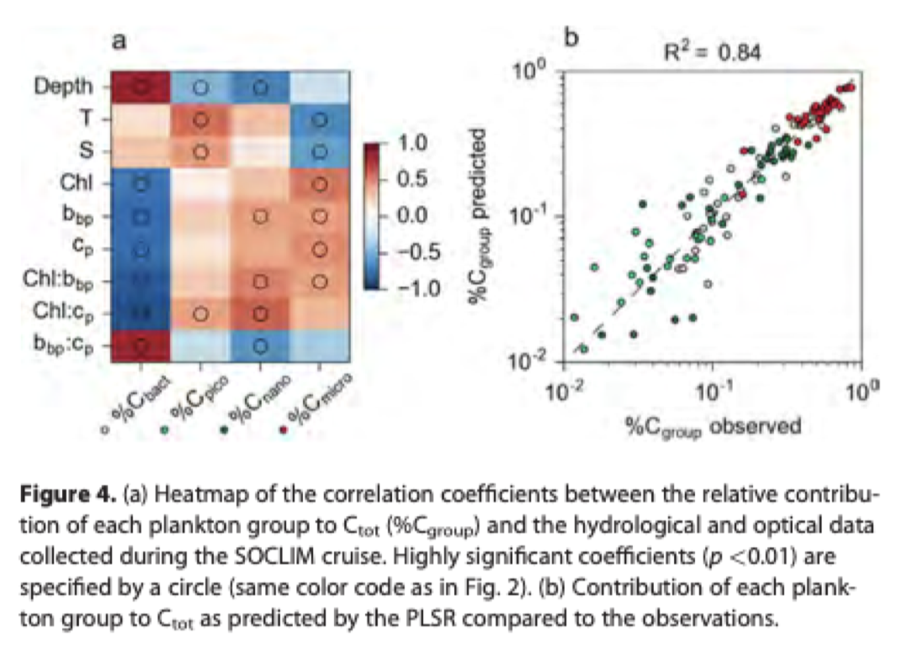

# Rembauville2017 summary

**Plankton Assemblage Estimated with BCE-Argo Floats in the Souther Ocean:**
**Implications for Seasonal Successions and Particle Export**

Link to paper on team Google Drive: https://drive.google.com/file/d/1muytLbI8fFfXYj3V5AWn4oZzgkncRUmm/view?usp=sharing

## Goal
*The SOCLIM (Southern Ocean and CLIMate) project aims to develop a multivariate transfer function that establishes relationships between bio-optical and physical measurements and the plankton community structure (from bacteria to microplankton). This transfer function is then applied to float data to predict and analyze the variability of plankton community structure in various seasons and SO environments. The relationship between predicted plankton community structure in the mixed and the presence of large particles in the mesopelagic layer is discussed.*

## Abstract
**Observations of the Southern Ocean (SO)**
- phytoplankton in the Southern Ocean (SO) affects global processes, but weather restricts direct observations in fall and winter
- spatial and seasonal changes in phytoplankton are described by the shipboard and BCG-Argo float measurements (physical and bio-optical)
- the results reveal a high contribution of bacteria below the mixed layer, low abundance of phytoplankton, and succession from nano- to microplankton in the spring
- iron-rich water yields higher phytoplankton biomass in spring and summer
- optical signals can be used to estimate particle diameter

## Introduction
**Implications of biodiversity in the SO**
- the SO represents 40% of oceanic $\text{CO}_2$ sink, and displays highly contrasted surface chlorophyll *a* concentrations
- biologically diverse areas give insight into carbon transfer to the ocean interior
    - iron-rich areas are highly productive; iron-limited areas have vast nutrients but low chlorophyll
    - phytoplankton species distribution is constrained by the east-flowing Antarctic Circumpolar Current
    - it is suggested that microplankton-dominated areas have high export efficiency but low transfer efficiency; the opposite is true for picoplankton

**Limitations of satellite-based approaches**
- combining satellite ocean color data with climatologies of physical data is sometimes used to compensate for missing physical measurements during fall and winter (similar to Sauzède2016)
- however:
    - observations are limited to the surface/upper layer
    - in the winter, sea-ice and cloud cover limit observations of accurate ocean color in the SO
    - Argo floats offer hope to observe this under-samples ocean region
- interpolation of bio-optical signals is complex, i.e., theory and emperical observations do not always align
    - need to consider plankton community structure, phytoplankton physiology, abiotic particles
    - affect and are affected by chlorophyll *a* fluorescence, $b_{bp}$
    - *understand co-variation of bio-optical measurements and plankton community structure before confidently interpreting float data*

## Methods
**Plankton carbon estimation and SOCLIM Cruise optical data**
- SOCLIM cruise samples the Indian sector of the SO in October 2016
    - conductivity-temperature-depth (CTD) measurements taken between $35\degree\text{S}$ and $58.5\degree\text{S}$
    - also measured chlorophyll *a* fluorescence $F$, particulate backscattering coefficient $b_{bp}$, and particulate beam attenuation coefficient $c_p$
        - $b_{bp}$ and $c_p$ are both proxies of particle abundance
        - chlorophyll *a* concetration *Chl* calcuated from calibrated and corrected the raw $F$ fluorescence
        - other values were filtered, averaged, etc.

- total plankton carbon $C_\text{tot}$ defined as the sum of bacteria, pic-, nano-, and microplankton carbon biomass: $C_\text{tot} = C_\text{Bact} + C_\text{Pico} + C_\text{Nano} + C_\text{Micro}$
    - the relative distribution of each group to $C_\text{tot}$ total: %$C_\text{group} = C_\text{group} / C_\text{tot}$

**Partial least square regression (PLSR)**
- identifies principle components without bias of collinearily (common in ecological data)
- X: predictor matrix of hydrological and optical data
    - features: depth, temperature, salinity, Chl, $b_{bp}$, $c_p$
    - ratios: Chl:$b_{bp}$, Chl:$c_p$, $b_{bp}$:$c_p$
- Y: matrix of response variables, namely %$C_\text{group}$
- due to small dataset, bootstrapping with 10,000 iterations of cross-validation was used to compute $\text{R}^2$ and root mean squared error (RMSE) of prediction
- model used to predict contribution of each plankton group to total plankton carbon for each float

**Quantifying large particle abundance and size**
- large particles cause spikes in fluorescence and $b_{bp}$ data
- *this does not seem relevant to our project; see Section 2.3 of the paper to learn more*

## Results and Discussion
**Plankton carbon estimation and predictive performance**
- microplankton dominates total plankton biovolume, but is generally a low contributor to $C_\text{tot}$
- where microplankton did not dominate, nanoplankton contributed significantly to $C_\text{tot}$ at 100m and 10m
- deep samples (250) had low particulate organic carbon (POC) concentration and strong bacterial contribution to $C_\text{tot}$
- picoplankton contribution was low in all samples (< 20%)
- linear relationship between $C_\text{tot}$ and measured POC had a slope of about 1
    - shows that existing estimates of plankton carbon are appropriate in various ocean zones
    - but, this is just a hypothesis
- **$c_p$ from floats was used to predict POC as oppsoed to $b_{bp}$** because the backscattering efficiency changes with the nature of particles
- RMSE differed between plankton groups

    

**Spatial and seasonal patterns of plankton community structure from float data**
- *see Section 3.2 for observations of different plankton groups in different zones and seasons*
- there are limitations and biases of this method, and it is advised to discuss only broad seasonal and geographical trends of predicted $C_\text{group}$ values
    - absolute values with high spatial resolution should be compared to classical sampling measurements

**Mixed layer community structure and partical dynamics**
- *this does not seem relevant to our project; see Section 3.3 of the paper to learn more*

## Conclusion
- the method in this paper reasonable estimates the carbon partitioning between the plankton groups: bacteria, pico-, nano-, and microplankton
- seasonal and geographical patterns of predicted plankton carbon partitioning appears consistent with literature data and existing estimates
- different plankton groups and bloom occurances are characterized by different fluorescence values, particle sizes, spikes in $b_{bp}$ signals, etc.
- autonomous floats have the potential to propagate relationships between plankton composition and optical proxies in space and time