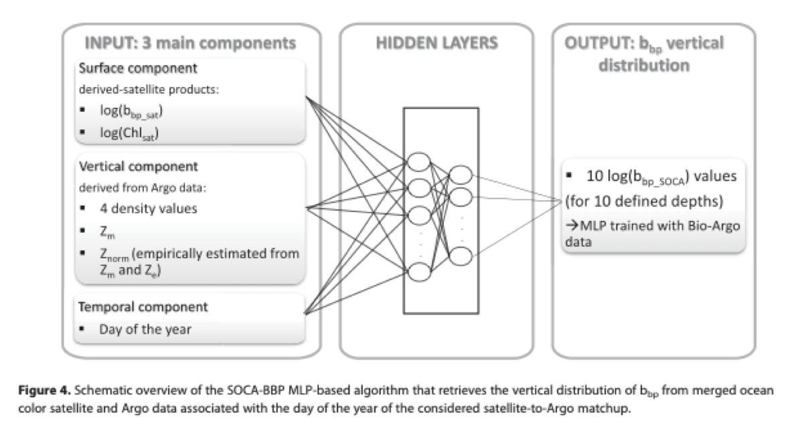
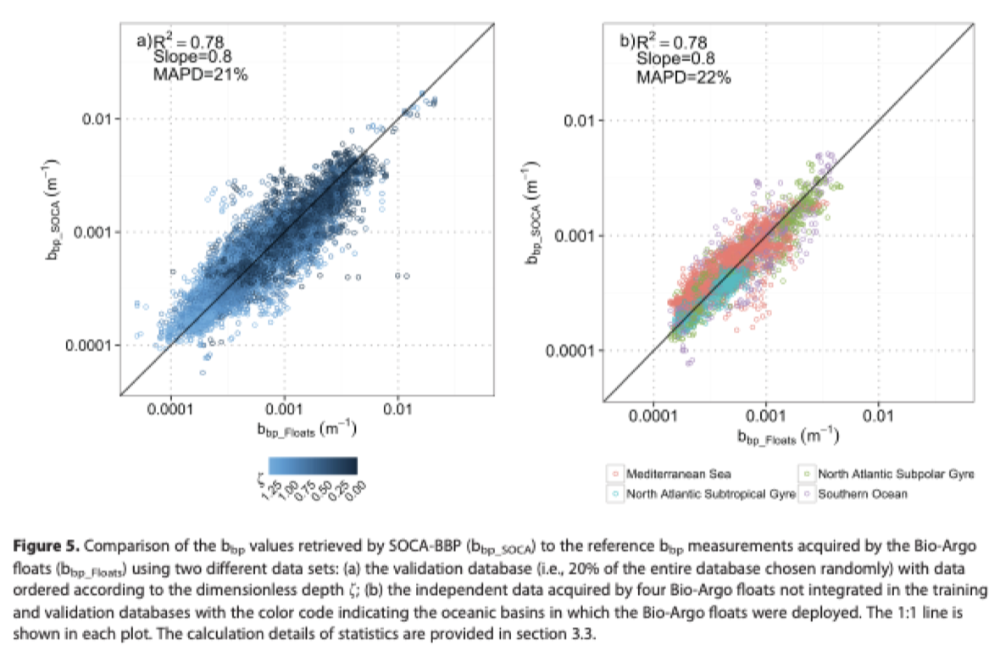
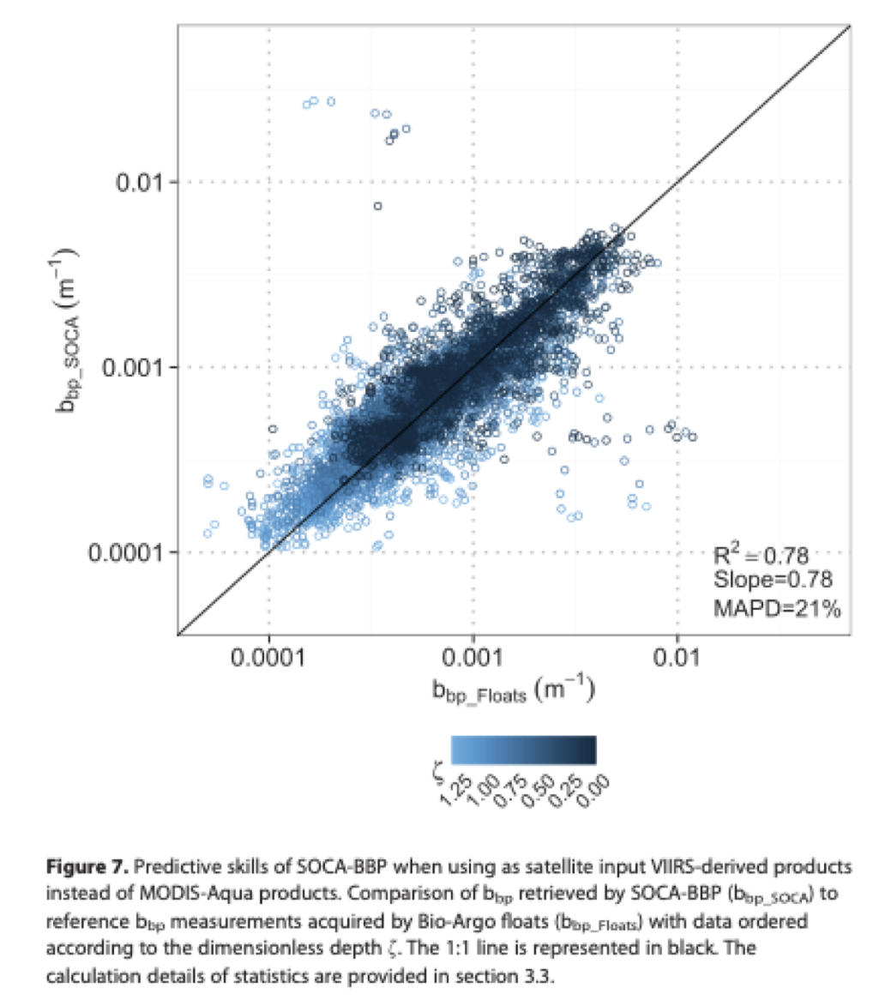
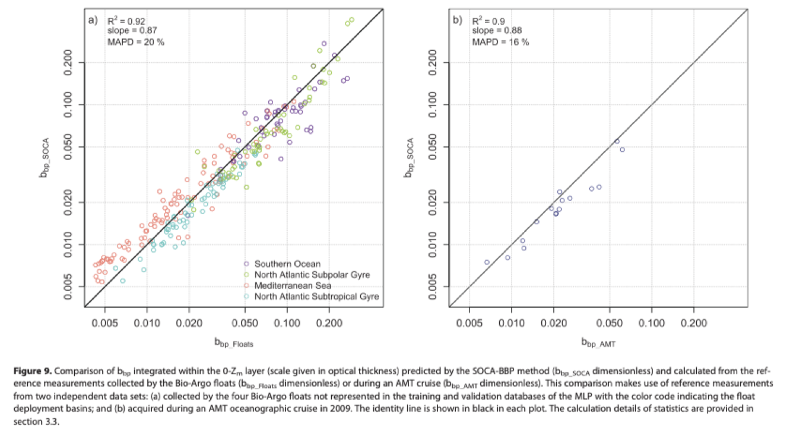

# Sauzède2016 summary

**A neural network-based method for merging ocean color and Argo data to extend surface bio-optical properties to depth: Retrieval of the particulate backscattering coefficient**

Link to paper on team Google Drive: https://drive.google.com/file/d/1ic7Udf3idYpEBBoWs6mkBo2om3a9dEr7/view?usp=sharing

*Note: the database, float details, and prodecures specific to this 2016 paper may or may not align with the data and details we are concerned with for this project in 2022.*

## Goal
*"Develop and examine the potential of a new global method for merging satellite ocean color and physical Argo data to infer the vertical distribution of $b_{bp}$ with a relatively high spatiotemporal resolution, i.e., the resolution of Argo-to-satellite matchup data"*

## Abstract
**SOCA-BBP**: Satellite Ocean-Color merged with Argo data to infer the vertical distribution of the Particulate Backscattering coefficient
- neural network-based method (multi-layer perceptron)
- main objective: merge satellite and float data without using vertical bio-optical float profiles
- three inputs:
        - satellite data: $b_{bp}$ and chlorophyll *a* (*chlor-a*) surface estimates
        - float data: temperature-salinity profiles at various depths
        - date: to match satellite and float data

## Introduction
**Particulate Organic Carbon (POC)**
- a vector of carbon export, composed of:
    - giogenetic detrital particles
    - microzooplankton
    - heterotorphic bacteria
    - viruses
    - aggregates present in the water column
- ocean sampling measurements are detailed and direct, but insufficient in time-space coverage
- optical sensors allow a broader range of study
- optical proxies developed, namely particulate backscattering coefficient and particulate beam attenuation coefficient

**$b_{bp}$: particulate backscattering coefficient**
- a key bio-optical property to study the space-time dynamic of POC and possibly phytoplankton biomass
    - a widely used optical proxy of POC
    - index of phytoplankton particulate load (dependent on particle size and phytoplankton size structure)
    - possible indicator of phytoplankton carbon and biomass (making it a possible alternative to *chlor-a*)
- can be measured continuously from autonomous floats and satellites sensing ocean color
- understanding $b_{bp}$ can help improve assessments and understanding of global ocean carbon fluxes

**Surface to depth**
- vertical distribution of POC is highly variable in time and space
    - satellites estimates—restricted to the ocean surface—are insufficient to measure carbon production and export
    - therefore extending surface $b_{bp}$ measurements (POC proxy) to below-surface $b_{bp}$  estimates is complex
    - must combine satellite information with nutrient availability, light regime, and other physical properties of the water column
        - accomplished by over 3800 Argo floats that measure upper 2000m of the ocean

## Data Presentation and Processing
**Bio-Agro floats**
- concurrent vertical profiles of temperature, salinity, and $b_{bp}$
- collect measurements 1000m to the surface with ~1 m resolution
    - collection as infrequent as once every 10 days, and as frequent as 3 times per day
- the databased contained 8300 vertical profiles from 83 floats from 2008 to 2015 (most after 2013)
    - 43% of profiles discarded after satellite matching for 4725 remaining floats
    - temporal data acquisition bias due to lack of satellite images aat high latitudes during fall and winter
    - Southern Hemisphere is underrepresented

**Volume scattering function (VSF)**
- $\beta(\theta,\lambda)$; defined as the angular distribution of scattering relative to the direction of light propagation $\theta$ at the optical wavelength $\lambda$
    - $\beta_p$ for particle contribution
    - $\beta_{sw}$ for pure seawater contribution
- $\theta = 124\degree$ when $\lambda = 700$ nm or 532 nm
- $b_{bp}(\lambda) = 2\pi\chi(\beta_p(124\degree, \lambda) - \beta_{sw}(124\degree, \lambda))$
    - moving foward, $b_{bp}$ indicates $b_{bp}(700)$; all profiles in data were converted to $b_{bp}(700)$ using a power law of spectral dependency

**Matching float profile data to satellite ocean color data**
- satellite $b_{bp}$ data estimated for wavelength of 700 nm
- each Argo profile was matched with the satellite data of surface $b_{bp}$ and chlorophyll *a* concentration (Chl) **using the closest pixel from the standard level 3 eight day MODIS-Aqua composites with a 9 km resolution**
    - source: http://oceancolor.gsfc.nasa.gov
- vertical profiles are normalized according to estimates of the depth of the "productive layer"
    - depth estimates are derived from the depths of the mixed layer (in mixed conditions) or the euphotic layer (in stratified conditions)
    - normalization enables all profiles to be merged regardless of vertical shape while preserving variability

## SOCA-BBP Algorithm Development
**Multi-Layer Perceptron (MLP)**
- three inputs
    - temporal component: day of year; normalized in radians $\text{Day}_\text{rad} = \frac{\text{Day}\cdot\pi}{182.625}$ so day 1 is close to day 365
    - surface component: satellite-derived log-transformed $b_{bp}$ and *chlor-a*
    - vertical components: nornalization depth, mixed layer depth, four density values along vertical profile (chosen through PCA)
- first hidden layer: eight neurons
- second hidden layer: six neurons
- loss function: quadratic difference between prediction and target values
- output
    - a vector of 10 normalized values of $b_{bp}$ at 10 depths
    - depths taken at regular intervals within the 0-1.3 normalized layer (called "dimensionless depths")
    - sigmoid activation
- inputs and outputs $x$ centered and "decentered" using $x_{ij} = \frac{2}{3} \cdot \frac{x_{ij} - \text{mean}(x_i)}{\sigma(x_i)}$ at respective dimensionless depths

**Model evaluation**
- $\text{R}^2$ coefficient and slope of linear regression between predictions and targets
- estimated model error: Median Absolute Percent Difference (MAPD) = median $\left( \frac{|b_{bp\_SOCA} - b_{bp\_Floats}|}{b_{bp\_Floats}} \right) \cdot 100$
- evaluate sensitivity of model to uncertainties in origin of satellite data

## Results and Discussion
**Results**
- SOCA-BBP predicts $b_{bp}$ without systemic bias (global error of retrieval of 21%)
- no bias according to vertical dimension from dimensionless depth of estimation
    - results from deepest layer 1-1.3 of dimensionless depth deteriorate slightly because $b_{bp}$ values are in a lower range

**Sensitivity to satellite input data**
- replaced MODIS-Aqua data with VIIRIS-derived data for additional validation
- still performed well, showing SOCA_BBP is robust to reasonable noise

**Additional validation and observations**
- model predictions are consistent with float data when other depths are estimated through linear interpolation of values in 10-dimensional output
- model underestimates $b_{bp}$ in the Mediterranean Sea, especially from July to October
- comparing depth-integrated estimations of $b_{bp}$ smooths estimation errors from noise in float data
- in addition to float data not seen in training, the model generalizes well to validation data collected from an additional source: Atlantic Meridonial Transect (AMT) cruise

**Application: global 3-D climatologies of $b_{bp}$**
- paper discusses under/overestimation of $b_{bp}$ in certain ocean basins, biases from estimation or measurement methods, and seasonality
    - it may be valueable to revisit this section, but some observations and arguments may be outdated
- use results to create a depth-resolved global proxy of POC and phytoplankton carbon with high space-time resolution
- model outputs and conclusion have the potential to sreve as benchmarks for temporal or regional trends

## Conclusion
- SOCA-BBP is a successful method for large-scale perspective and climatology product development
    - at the time of this paper, it was not yet developed vertical $b_{bp}$ distribution for specific location/satellite-float matchup at a given time
- uncertainties in satellite bio-optical data may generate uncertainty in $b_{bp}$ distribution retrieval
    - however, success of the model across both MODIS-Aqua and VIIRIS data indicates that the model accounts for reasonable noise during training
- results may be extended to analyze phytoplankton biomass or *chlor-a* concentration
    - the latter may be more valuable, as studies have shown that the cellular Chl-to-carbon ratio may impact *chlor-a* concentrations more than phytoplankton biomass itself over large oceanic regions
    - this is a prerequisite to improving the characterization of the distribution and variability in carbon export
- this study may be extended beyond to $b_{bp}$ to other features such as chorophyll *a* concetration and CDOM
